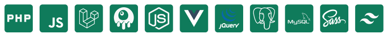

# Hi, I'm Joe 👋🏾 👨🏾‍💻

&nbsp;

I ❤️ solve great challenges using tech.    From backend development using Flask to frontend development using ReactTS, I am <strong>passionate to discover new stuffs</strong> and use them to create high quality solutions. Today, I'm a <strong>full stack mid-level developer</strong> focused on web development.
&nbsp;

  

      <h3>🗣 About</h3>
      - 📍  Goiânia, Goias - Brasil  
      - 🔭 Atualmente trabalho com Full Stack  
      - 🌱 Estudando qualquer coisa
  

### 🔲 Languages, Technologies:

### 🔲 Tools:

##### MOTTO

> When your work speaks for itself, don't interrupt. - Henry J. Kaiser

 

    
    

      
 

### 🎧 Spotify Playing

<!--  -->

# Contact me:

    
    
    

&nbsp;&nbsp;

