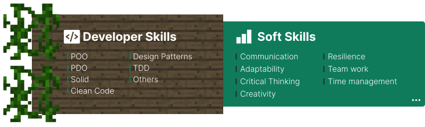

&nbsp;

   
    
I ❤️ solve great challenges using tech.    From backend development using Php to frontend development using Laravel, Vue or React, I am <strong>passionate to discover new stuffs</strong> and use them to create high quality solutions. Today, I'm a     <strong>full stack junior developer</strong> focused on web development.
&nbsp;

&nbsp;

### 🔲 Languages, Technologies:

### 🔲 Tools:

   

##### MOTTO

> When your work speaks for itself, don't interrupt. - Henry J. Kaiser

 

    
    

      
 

## Contact me:

    
    

&nbsp;&nbsp;

